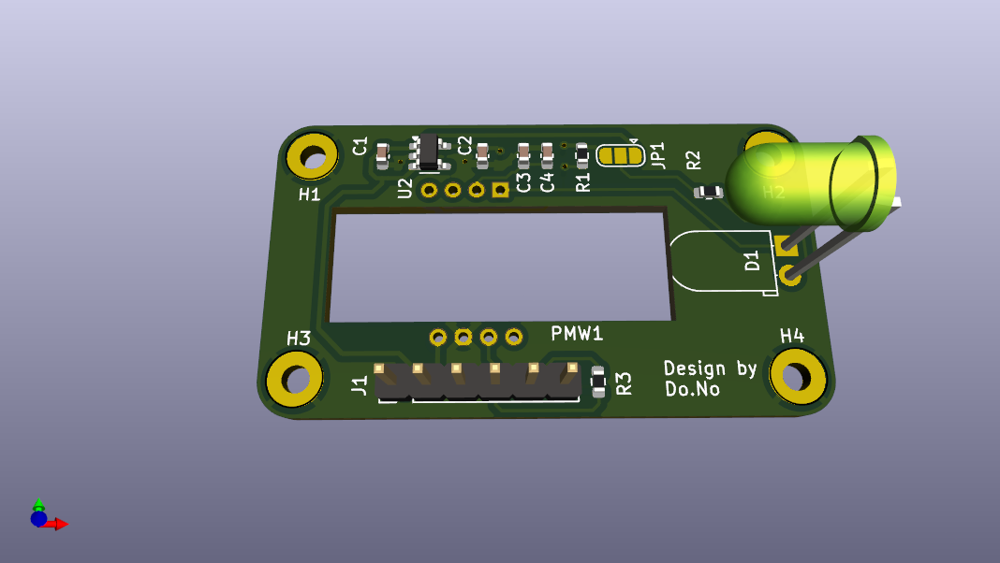
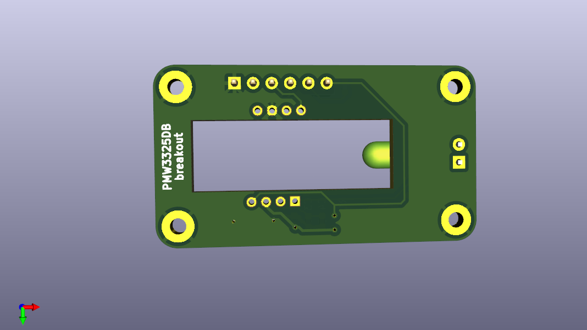

# PMW3325DB-TWV1 breakout board

This repository contains PCB design files for a breakout board for the PMW3325DB optical mouse sensor.

The board doesn't do any level shifting so it only works with 3.3V logic.

The dimensions of the board are 45x25mm and the mounting holes are for M2 screws with meta inserts.

The files in the [fabrication](fabrication) folder can be used to order this board from JLCPCB with SMT assembly. The board you get includes everything except the actual sensor. If some of the specific components are out of stock, try to find an equivalent with the same package and parameters.

If the volatage regulator **TCR2EF19** is out of stock, you can replace it by using the following configuration :

| **Reference** | **Part Name**         | **JLCPCB P/N**    |**Description**|
|------------   |---                    |---                |---|
| U2            | TLV74318PDBVR         | C15849            | Voltage regulator with Vout = 1.8v  |
| C1            | C15849 CL10A105KB8NNNC| C485152           | Capacitor of 1uF  |

**Warning** Don't forget to turn the TLV74318PDBVR when making the position during the PCBA process

The sensor chip should be soldered on the top side (the side where all the other components are). The dot marks pin 1. The optic goes on the bottom side.

